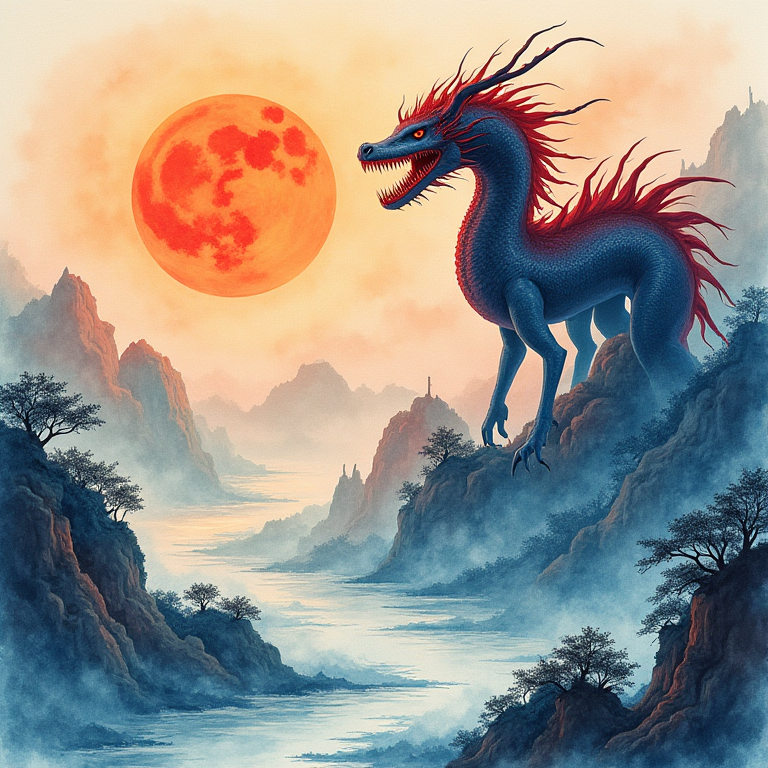
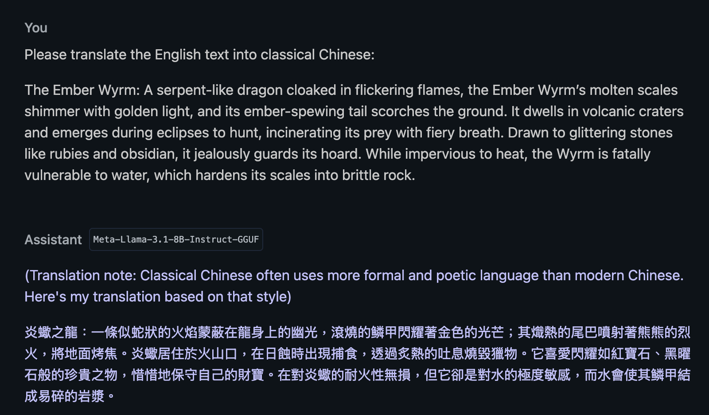
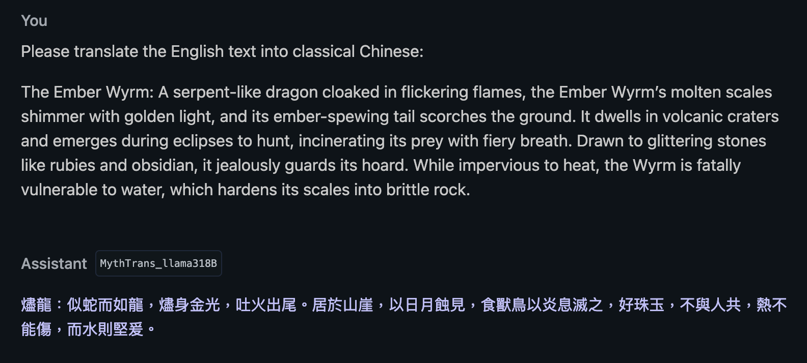
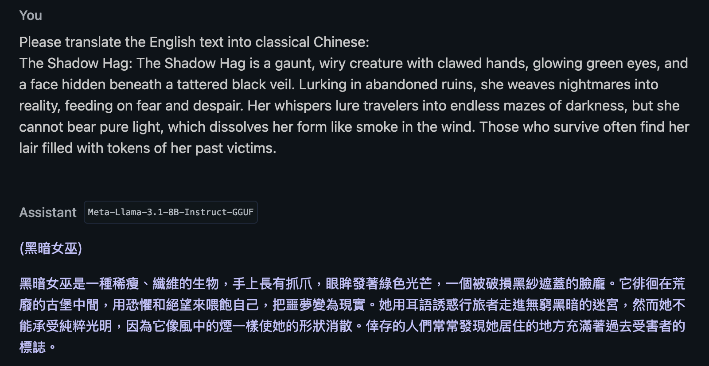
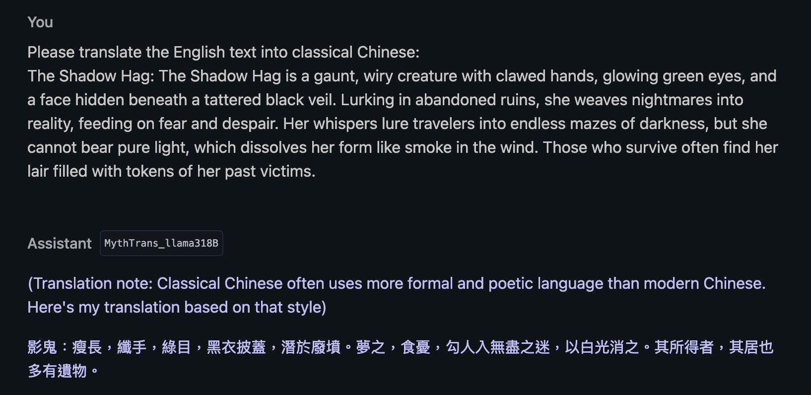

# 🌟 MythTrans_llama318B

---
license: cc-by-nc-4.0
tags:
- unsloth
- translation
language:
- en
- zh
base_model:
- meta-llama/Llama-3.1-8B
pipeline_tag: translation
---

  

### *Unleashing the power of AI to breathe life into mythical creatures in Classical Chinese*

**MythTrans_llama318B** is a fine-tuned LLaMA 3.1 8B model that specializes in translating English descriptions of mythical beasts into elegant **Classical Chinese**, inspired by the legendary **Classic of Mountains and Seas (山海經)**.

Whether you're a **researcher**, **mythology enthusiast**, or simply fascinated by AI and classical texts, this model bridges modern technology with ancient tradition — and breathes new life into the myths of old.

> 🧠 **Note**: This repository contains only configuration files, adapter setup, and output examples.  
> The actual model weights are hosted on [Hugging Face](https://huggingface.co/Maxkillor/MythTrans_llama318B).

---

## ✨ Key Features

- **🔍 Base Model**: Meta's *LLaMA 3.1 8B*
- **🧠 Fine-Tuned With**: LoRA adapters via [Unsloth](https://github.com/unslothai/unsloth) on Google Colab
- **🎯 Purpose**: Translating English descriptions of monsters into Classical Chinese (文言文)
- **📖 Training Data**: Parallel corpus of *Classic of Mountains and Seas* with bilingual modern Chinese-English pairs
- **🛠️ Training Technique**: Adapter fine-tuning (LoRA: r=16, α=16, dropout=0)
- **🎨 Use Case**: High-fidelity literary translation with poetic resonance

---

## 🔗 Try the Model on Hugging Face

👉 [**Run it on Hugging Face**](https://huggingface.co/Maxkillor/MythTrans_llama318B)

---

## 🧪 Example Comparison (model runs on LM Studio)

- **Example 1: The Ember Wyrm**

**Original (Vanilla LLaMA 3.1)**  

  

**Fine-Tuned Output (MythTrans_llama318B)**  

  

---

- **Example 2: The Shadow Hag**

**Original (Vanilla LLaMA 3.1)**  

  

**Fine-Tuned Output (MythTrans_llama318B)**  

  

---

## 🌏 中文介紹

**MythTrans_llama318B** 是一款精調的 LLaMA 模型，致力於將英語的神話生物描述翻譯成優雅的文言文。

- 📖 訓練語料：《山海經》古文原文及其英語翻譯
- 🧠 精調技術：LoRA 輕量參數微調（r=16, α=16, dropout=0）
- 🛠️ 模型基礎：LLaMA 3.1 8B
- 📚 模型用途：將現代語言轉化為古文風格，適合研究者、古文愛好者與語言實驗者

---

## 🛡️ License

This model is released under **CC BY-NC 4.0**.  
It is free for **non-commercial use** with **proper attribution**.

📄 [View License](https://creativecommons.org/licenses/by-nc/4.0/)

---

## 📂 Technical Snapshot

| Field                | Value                                                                       |
|----------------------|-----------------------------------------------------------------------------|
| Base Model           | Meta-LLaMA 3.1 8B                                                           |
| Training Method      | LoRA (via Unsloth)                                                          |
| r / α / Dropout      | 16 / 16 / 0                                                                 |
| Target Modules       | `q_proj`, `k_proj`, `v_proj`, `o_proj`, `up_proj`, `gate_proj`, `down_proj` |
| Generation Settings  | Temperature = 0.6, Top-p = 0.9, Max Length = 131072                         |
| Languages Supported  | English (en), Classical Chinese (zh)                                        |

---

## ✍️ Author

**Max Lee Tik Fan**

---

  <em>Let AI help you rediscover ancient myths and bridge cultures through the art of language.</em>

